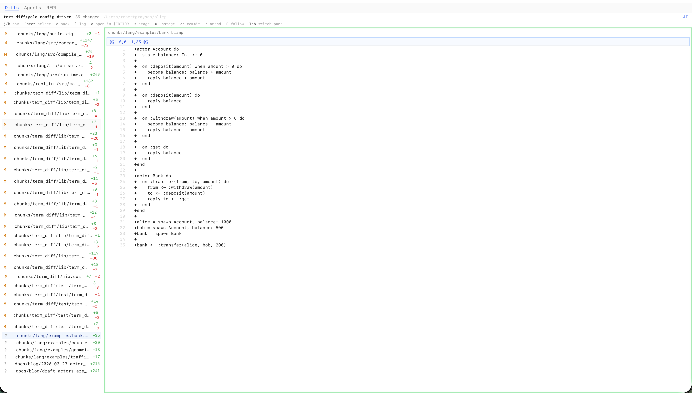
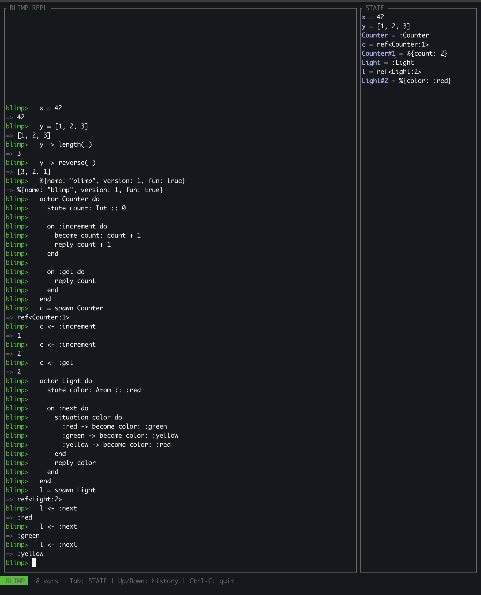

# Actors Are Alive

_March 23, 2026_

## Since the Grammar

Last time we walked through every piece of the Blimp grammar.
Actors, typed state, pipes, message sends, guards, Holes, situations, bubbles.
The parser was real, it could chew through stuff like this:

```
actor Counter do
  state count: Int :: 0

  on :increment do
    become count: count + 1
    reply count + 1
  end
end
```

But that was it.
You could parse it into an AST and stare at a tree.
Nothing ran, nothing evaluated, nothing compiled.

So we kept going.
Naturally, working on this language the way I am, and moving so quickly, viewing diffs became the key piece of the work more than being in an editor.
Viewing these diffs and commenting on them to influence code was done much more than hand crafting, and that needs to feel better than what we've got right now.
So before we could make the language do anything, we needed a way to watch the work happen.



## The Diff Viewer

The goal is Magit in a browser.
We're not there yet, but we're getting closer.

It's a Phoenix LiveView app that watches `.git/index` and refs, picks up changes in real time, and renders diffs.
Two panes: file list on the left, diff on the right.
Everything keyboard-driven.
`j`/`k` to move, `Tab` to switch panes, `Enter` to expand a file, `s` to stage, `u` to unstage, `l` to open the git log.
The active pane gets a green glow, the selected item gets a blue highlight.

The interesting engineering is the navigation state machine.
Early on we had the keyboard handling mixed into the LiveView, and it was a mess.
Every new keybinding meant touching the same giant `handle_event` function, and the interactions between focus states and pane switching got tangled fast.
Browser `Tab` kept fighting with LiveView's keydown handling until we wrote a JS hook that prevents default on the keys we care about.

So we ripped all that out and built a pure functional state machine.
It takes a key event and the current focus state, returns the new state plus a list of signals like `{:stage_file, path}` or `{:open_file, path}`.
The LiveView converts those signals into actual git commands and DOM updates.
There are no side effects in the state machine, fully tested, easy to reason about.
The functional core does the thinking, the imperative shell does the doing.

The thing it still doesn't have is syntax highlighting in the diffs, which is dumb.
You're looking at code all day and the diffs are just plain green and red lines.
That's on the list.

The thing it does have that's cool is line selection.
You can highlight a line or a range of lines in a diff, write some commentary about what you want changed, and send an agent off to do the work.
The agent spawns in the multiplexer (more on that next) and you watch it go while you keep reviewing other diffs.
That feedback loop, of looking at code and being able to just point at something and say "fix this", is the whole point.

## The Multiplexer

The diff viewer shows you what changed.
The multiplexer shows you who's changing it.

It runs up to five Claude sessions simultaneously, each in its own pane, streaming output in real time.
You click some lines in the diff viewer, write a comment like "this error handling is wrong, use bubbles instead", and an agent spawns.
It shows up in the multiplexer and starts working while you go back to reviewing other files.


The orchestrator behind it is a GenServer that manages the whole lifecycle.
It enforces max concurrent slots, queues runs when you're at capacity, detects stalled agents that stop producing events, and retries failed runs with exponential backoff.
Each agent is a `claude` CLI process spawned via Erlang Port, parsing NDJSON events as they stream in.
When an agent needs permission to run a tool, like editing a file or running a test, the request shows up as Allow/Deny buttons inline in the output.
You don't leave the browser.

The part I think is genuinely interesting is the deciduous integration.
Every agent that spawns gets a root node in the decision graph.
The agent's system prompt tells it to log its reasoning as it works: goals, options, decisions, actions, outcomes.
When the agent finishes or dies, its decision subtree stays in the graph.
A new agent can look at what the dead one was thinking and pick up where it left off.
Active agents can see what other agents are working on and which files they're touching.

We talked about this in the first post, how each agent would have a deciduous tree and the trees could merge and diverge.
It's not hypothetical anymore.
The agents have living memory.
It's rough and early but it works.

## Actors Come Alive

So, tooling exists.
I guess the next step is the language.

Last post we walked through what actors look like syntactically.
Now they actually do things.
The evaluator is a tree-walking interpreter, the simplest thing that could work.
You hand it an AST node, it walks the tree recursively and produces a value.
No bytecode, no intermediate representation, just "look at this node, evaluate its children, combine them."

It handles everything the parser can produce: arithmetic with proper precedence, strings, atoms, booleans, nil, lists with the cons operator, tuples, maps, variable assignment, pipes with `_` placeholder, `orelse` for nil fallback, `situation` and `case` branching, dot access on maps.
Nine builtins: `length`, `max`, `min`, `append`, `reverse`, `lookup`, `put`, `keys`, `now`.
Not many, but that's on purpose.
The standard library in Blimp will be actors, not a big bag of functions.
`System.IO`, `System.Math`, `System.String`.
Everything is an actor.

But the real thing is that actors are alive now.

When you write `actor Counter do ... end`, the evaluator registers a template.
It's a blueprint, not an instance.
You call `spawn Counter` and the runtime creates an instance with its own state, assigns it a ref, and puts it in the global registry.
That ref is how you talk to it.

```
actor Counter do
  state count: Int :: 0

  on :increment do
    become count: count + 1
    reply count + 1
  end

  on :get do
    reply count
  end
end

c1 = spawn Counter
c2 = spawn Counter

c1 <- :increment   # => 1
c1 <- :increment   # => 2
c2 <- :increment   # => 1
c1 <- :get          # => 2
c2 <- :get          # => 1
```

Two instances, completely independent state.
`c1` has been incremented twice, `c2` once.
They're lightweight refs like Erlang PIDs.
`become` updates the state for the next message, not the current scope.
That's real actor semantics, not a simulation.

You can override state at spawn time too.
`spawn Counter(count: 100)` creates a counter starting at 100.
No constructor patterns, no factory methods.
The defaults in the template are just defaults.

State machines fall out of this for free:

```
actor Light do
  state color: Atom :: :red

  on :next do
    situation color do
      :red -> become color: :green
      :green -> become color: :yellow
      :yellow -> become color: :red
    end
    reply color
  end
end

l = spawn Light
l <- :next    # => :green
l <- :next    # => :yellow
l <- :next    # => :red
```

No state machine library, no framework.
An actor with one state field and a `situation` that cycles through values.
That's a state machine.

Guards give you multi-clause dispatch:

```
actor Account do
  state balance: Int :: 0

  on :deposit(amount: Int)
      when amount > 0 do
    become balance: balance + amount
    reply balance + amount
  end

  on :withdraw(amount: Int)
      when amount > 0 do
    become balance: balance - amount
    reply balance - amount
  end

  on :withdraw(amount: Int)
      when amount <= 0 do
    reply :error
  end
end
```

Two handlers for `:withdraw`, different guards.
The runtime tries them in order and picks the first match.
No nested `if` inside `case` inside the handler body.
Just separate handlers with clear conditions.

And the `_` Hole operator works in `situation` branches.
You write the branches you know and the agent fills the rest.
The comment after a Hole is a directive to the agent, not a note to yourself:

```
on :charge(payment: Payment) bubbles(CascadeBubble) do
  situation validate(payment) do
    :valid ->
      receipt = items
        |> calculate_tax(_, region)
        |> finalize(_, payment)
      become items: [], total: 0.0
      reply receipt
    _ # Hole: handle invalid payment,
      # begin by researching documentation
      # on transaction failure
  end
end
```

The agent sees that Hole in the AST, reads the comment, and gets to work figuring out what should go there.
You don't leave your code to write a prompt.
The Hole is the prompt.

## Errors That Help

The Elm compiler set the bar for error messages and I wanted to go for it.
Every error tells you what went wrong, shows you the line that caused it, and tells you what's available so you can fix it.

```
blimp> bonk + 1

-- UNDEFINED VARIABLE ----------------------------

  bonk + 1
  I can't find a variable called `bonk`.

  Variables in scope:
      x = 42
      y = [1, 2, 3]
```

```
blimp> foobar(42)

-- UNKNOWN FUNCTION ------------------------------

  foobar(42)
  I don't know a function called `foobar`.

  Built-in functions:
      length, max, min, append, reverse,
      lookup, put, keys, now
```

Six error types, all with this format.
**UNDEFINED VARIABLE** lists what's in scope so you can spot the typo.
**TYPE MISMATCH** shows both types so you know what you have vs what was expected.
**DIVISION BY ZERO** because yeah.
**UNKNOWN FUNCTION** lists the available builtins.
**NOT AVAILABLE IN REPL** nudges you toward expressions the REPL can evaluate.
**NO MATCHING HANDLER** names the actor and the message that didn't match, which is huge for debugging actor communication because you immediately know "oh, I sent `:incremnt` instead of `:increment`."

The implementation is stupid simple.
A struct with a title, an optional source line, an optional column for the caret, a message, and an optional hint.
One format method that writes colored output on TTYs and plain text when piped.
Zig makes this really clean because `anytype` writers mean you don't care where the output goes.

I am going to basically be studying the Elm and Elixir compilers to rip off how to keep making this better.

## Compiled to Native

Separate from the REPL there's a compiler.
`blimp-compile hello.blimp -o hello` takes source, runs it through the same parser, and instead of evaluating the tree it generates LLVM IR.

Zig's `@cImport` makes this surprisingly pleasant.
You import `llvm-c/Core.h` and you're calling LLVM functions directly from Zig with full type safety.
No FFI bindings to generate, no wrapper libraries.
Just `@cImport` and go.

```
$ cat hello.blimp
1 + 2 * 3

$ blimp-compile hello.blimp --run
7

$ blimp-compile hello.blimp --dump-ir
; ModuleID = 'blimp_module'
define i64 @main() {
entry:
  ret i64 7
}
```

Every expression type compiles: literals become LLVM constants, binary ops become add/sub/mul/div instructions, variables are allocas, pipes compile by substituting `_`, `situation` and `case` become conditional branches.

But the fun part is actors.
An actor definition compiles to three things: a state struct type (each `state` field becomes a struct member), handler functions (each `on` block becomes an LLVM function that takes a pointer to the state struct), and a handler table mapping atom IDs to function pointers.
`spawn` allocates the struct, initializes defaults, registers with the runtime, builds the table.
`<-` compiles to a runtime call that looks up the handler by atom ID, tries each clause's guard, and calls the first match.
`become` writes to the struct via GEP.
`reply` builds a `{i1, i64}` return pair, the i1 being "has reply" and the i64 being the value.

```
$ cat counter.blimp
actor Counter do
  state count: Int :: 0

  on :increment do
    become count: count + 1
    reply count + 1
  end

  on :get do
    reply count
  end
end

c = spawn Counter
c <- :increment
c <- :increment
c <- :increment
c <- :get

$ blimp-compile counter.blimp --run
3
```

The compiler links against a tiny C runtime, about 260 lines, that provides what LLVM IR can't do alone: a global actor registry, handler table management, a mailbox per actor (ring buffer, capacity 256), message dispatch with multi-clause guard support, synchronous send, and a round-robin scheduler that drains pending messages.

It's deliberately dumb right now.
Fixed-size array of actor pointers, a round-robin loop, no preemption.
The whole point is that this grows into the real actor runtime later, with per-actor memory arenas, Perceus reference counting, and preemptive scheduling.
But you start with the dumbest thing that works and iterate.

## The REPL

The REPL auto-detects whether you're on a TTY.
If you are, you get TUI mode: your session on the left, live state sidebar on the right.
Every variable you define, every actor you spawn, shows up on the right immediately.
If you're piped or not on a terminal, you get clean plain-text output.



There's also an `--introspect` flag that switches the output to JSON.
Instead of pretty-printing results, the evaluator dumps its whole state: variables, actor refs, the last expression result, errors.
This is how the web tools consume the language.
The Phoenix app has a REPL explorer at `/repl` that runs `blimp file.blimp --introspect` and renders the JSON in the browser.
The language has an API from day one, not because we planned it that way, but because the web tooling needed to talk to the evaluator and JSON was the obvious move.

We also started on a TUI REPL with libvaxis, a proper terminal UI framework for Zig.
TEA architecture for state management, vim modes (normal/insert/command), syntax highlighting, tab completion.
The current raw ANSI version works but the libvaxis version is going to feel like an actual editor.
That's still in progress.

## The Tools Build the Tools

I keep coming back to this.
We use the diff viewer to stage and commit the Zig files that make up the language.
The multiplexer spawns agents that write those Zig files while we watch the diffs update.
The decision graph tracks every design choice we make along the way.
And the language has a JSON introspection API that the Phoenix app consumes to provide a web REPL.

So the web tooling that helps build the language is also a consumer of the language.
When we start writing Blimp's standard library, agents in the multiplexer will be writing Blimp code, using tools written in Elixir, consuming output from a Zig compiler, all visible through a LiveView that shows you the diffs in real time.

The first post said "we're building the tool that builds the language that defines the tool."
That sounded like a cool thing to say at the time.
But it's actually what's happening now and I think that's pretty neat.
Every improvement to the diff viewer makes it easier to build the language.
Every improvement to the language brings us closer to the point where the tools can be expressed in Blimp.
It has a lot of nuance and power to be able to build another thing that lets us build more things using the thing, right?
I love meta shit.

## What We Haven't Figured Out Yet

Pattern matching in handlers.
Right now `on :add(item: Item)` just binds `item`.
We want destructuring like `on :add(%{price: price, name: name}: Item)` but haven't nailed how patterns and types coexist in the syntax.

The scheduler.
No shared memory means we need green threads in WASM.
The BEAM does preemptive scheduling with reduction counting.
We'll probably start with cooperative yields at message receive points and see how far that gets us.

Variable rebinding.
`x = 52` then `x = 8`.
Should that be an error?
Immutability says yes, but REPL ergonomics say maybe not.
We might end up with error in files but allowed in the REPL, or just a warning.
Haven't decided.

Closures and higher-order functions.
We don't have `fn` expressions yet.
You can pipe, you can send messages, you can call builtins.
But you can't pass a function as an argument.
This matters for things like `map` and `filter` on lists, and we need to figure out if those are builtins, actor messages, or something else.

The Blimp IR.
Right now the compiler goes straight from AST to LLVM IR.
That works for expressions and simple actors, but we need our own SSA-based intermediate representation for optimization passes, Perceus reference counting insertion, and eventually WASM output.

And the canvas.
What does it look like to paint a running program?
Actors are geometric, messages are lines between them, state transitions are visual.
Where there's a Hole, maybe there's randomness, fractals, noise.
It's the thing that excites me the most and the thing I know the least about how to build.

None of this is settled.
But the actors are alive, and that feels pretty good.
